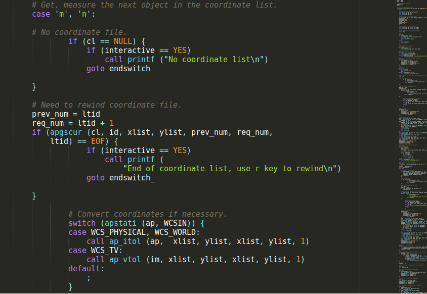
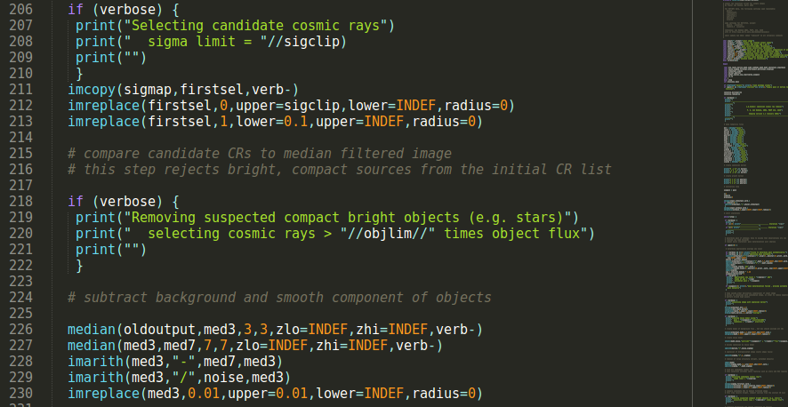

# SPP Highlighter

This is a highlighter for SPP language, a language used for IRAF ([Official](http://iraf.noao.edu/), [Wikipedia](https://en.wikipedia.org/wiki/IRAF)). It works not only for ``.x`` files, but also the IRAF CL scripts (``.cl`` files).

Basic structure of the syntax file is heavily based on the C sublime-syntax from [sublimehq repo](https://github.com/sublimehq/Packages). 

**It is a byproduct of my own research and the TA work of the *Astronomical Observation and Lab 1 and 2* courses offered at Seoul National University, in 2017.**

First, what SPP is, how to download and install, and then the purpose of making this incomplete highlighter:

## SPP

What the heck is SPP? From STSDAS web archive:

> [STSDAS User Guide](http://stsdas.stsci.edu/documents/SUG/UG_51.html)
>
> Most IRAF and STSDAS applications are written in **SPP**, or Subset PreProcessor, which is *the native programming language of the IRAF system*. SPP is based on RATFOR--rational Fortran--and combines the familiarity of Fortran with some features of the C programming language.

> [SPP Reference Manual](http://stsdas.stsci.edu/documents/SPP/SP_4.html)
>
> The SPP language is *based on the Ratfor language*. Ratfor, in turn, is *based on Fortran*, with extensions for structured control flow, etc. The lexical form, operators, and control flow constructs are identical to those provided by Ratfor. The major differences are the data types, the form of a procedure, the addition of inline strings and character constants, the use of square brackets for arrays, and the task statement. In addition, the SPP I/O facilities provided are quite different and are tailored to the IRAF environment. The syntax of the SPP language is fairly straightforward and fundamentally similar to most other high-level languages. While it is based on the Ratfor language, there are elements of C as well as elements of Fortran. SPP is a preprocessed language. That is, there is no SPP compiler per se, but it is translated into another compilable language. In fact, *SPP is first translated into Ratfor, which is processed into Fortran*. The xc compiler performs all preprocessing, compilation, and linkage.

This is made solely for IRAF, a rather interactive software for astronomical CCD data reduction. Now virtually no one is working on this language. Rather you might have experience in using ``cl`` script which utilizes ready-made tasks like ``IMCOMBINE`` and ``PHOT``.

## Download & Installation

Download this repo by either

1. clicking ``Clone or download`` button on the top right and clicking ``Download ZIP``, and unzip it,
2. typing ``git clone https://github.com/ysBach/mdnotes.git `` on the terminal. You may need [Git](https://git-scm.com/downloads) for this.

Then use the syntax definition file to your editor.

-----

For example, for [Sublime Text 3](https://www.sublimetext.com/3), move the (unzipped) directory (or folder) to an appropriate place. 

* Windows: ``%APPDATA%\Sublime Text 3\Packages\User``
* OS X: ``~/Library/Application Support/Sublime Text 3/Packages/User``
* LINUX: ``~/.config/sublime-text-3/Packages/User``

For other editors, you may use the included tmLanguage file: ``\Syntaxes\spp.tmLanguage``. Depending on the editor you are using, there should be ways to use it to make highlighter.

-----

### Example 1: SPP source code 

This is a part of ``$IRAF/iraf/noao/digiphot/apphot/apphot.x`` where ``$IRAF`` is ``home/user/anaconda3/envs/iraf`` for me:

### Example 2: CL script file

This is a part of the cosmic ray rejection script ([L.A.Cosmic](http://www.astro.yale.edu/dokkum/lacosmic/) developed by P. G. van Dokkum):

## Purpose

First of all, I am not a programmer, developer, or a computer scientist. Neither am I practiced so. I got to know some terms like ``tmlanguage`` or ``sublime-syntax`` file only ~ 1 day ago since the first commit of this repo. But due to some reasons, I had to make some small effort to this work. This is never intended to be regarded as a perfect work, and I may not be able to maintain or update this repo. (I actually don't see any reason to make it perfect.)

Although it's been decades since SPP appeared and number of astronomers have been using IRAF, **there is no single highlighter for SPP or CL script I could find**. It is quite bothersome since I had to crosscheck my python code with IRAF while preparing for the TA material. Especially when I found IRAF is not always giving results as expected (includes centroiding and aperture photometry), I felt the necessity of highlighter for readability. Thus, I had to make this highlighter, **NOT to develop source codes using SPP, but to see how IRAF works internally** (since the documents are not enough to understand the black box!). 

I am sure there are extremely few people who know how the aperture trace, cosmic ray rejection, photometry, or centroiding is working in IRAF. It is always required to look inside the original source code to understand the documentation, especially if the documentation is vague. For example, can you understand what ``Full-width at the base (in pixels) of features to be identified.``  actually means? (``fwidth`` of ``noao.onedspec.identify`) This is critical since it means only those people who looked into the source code can understand the results. While looking inside IRAF, the highlighter was quite necessary, and I guess it goes true for most people who did so.

At the beginning, I didn't care much about jargons like ``keywords`` and ``conditionals``, but just used C/Python highlighter or made all SPP keywords (like ``call``, ``include``, etc) as a same color. Then I changed my mind to copy and modify the pre-existing syntax file, which resulted in this repo. I have never, and will never study SPP heavily, so the syntax file may contain many wrong classifications, but anyway the "coloring" itself works quite reasonably as far as I tested, and it fulfills my original purpose. So I stopped modifying it further and made this repo.

